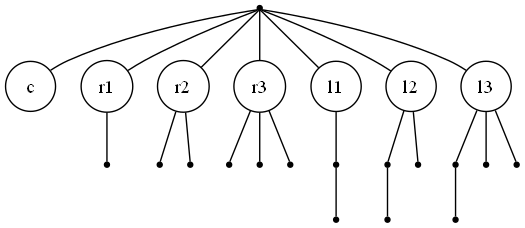
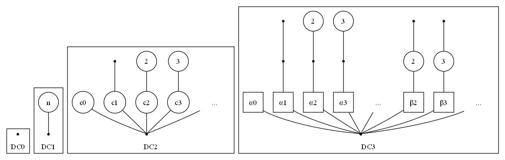

<script type="text/javascript" id="MathJax-script" async
  src="https://cdn.jsdelivr.net/npm/mathjax@3/es5/tex-mml-chtml.js">
</script>
<script type="text/javascript">
    window.MathJax = {
        tex: {
          inlineMath: [['$', '$'], ['\\(', '\\)']]
        }
      };
</script>

**Dendritic Calculus** is an [esoteric programming language](https://esolangs.org/wiki/Main_Page) with one single register whose value is an unlabeled rooted tree. No other memory is available. Only two arithmetic operations may be applied in place to the register, plus a simple control loop. Nevertheless, it is Turing complete.

DC is influenced by [FRACTRAN](https://en.wikipedia.org/wiki/FRACTRAN) and the [Iota and Jot](https://en.wikipedia.org/wiki/Iota_and_Jot) languages. It also is probably strongly related to [counter machines](https://en.wikipedia.org/wiki/Counter_machine).

# Dendrons

A **dendron** is a data structure that can be defined inductively, alongside a naming scheme:

- $0$ is the empty dendron, containing only the root node with no children. It has depth 0.
- If $α$ is a dendron, then $[α]$ is the dendron with $α$ as its only child. The brackets can be called an exponential, and they increase depth by one.
- If $\alpha$, $\beta$, $\gamma$... are dendrons, then the sum $α+β+γ+\ldots$ is the dendron obtained by merging their roots. Order of children doesn't matter, so sum is commutative. $α+0 = α$, so the empty dendron is really a zero. The depth is the maximum of the depths.


We can also define a multiplication between two dendrons:

- $α0 = 0α = 0$
- Multiplication is commutative and distributes over addition both on the left and on the right, i.e. $(α+β)γ = αγ+βγ$ and $α(β+γ)= αβ+αγ$.
- Product of exponentials sums the exponents: $[α][β] = [α+β]$

We can see $[0]$, a.k.a. $[]$, is the multiplicative identity, so we can call it $1$. Then, $1+1$ can be called $2$, $1+1+1$ is $3$, and so on. Thus, regular numbers are represented as dendrons with only that number of leaf children.


A dendron $\alpha$ with distinct children $\beta_1,\beta_2,\ldots$, each appearing $c_0,c_1,\ldots$ times, can be written like this:

$$
α = c_0 [β_0] + c_1 [β_1] + ... + c_n [β_n]
$$

We call this **normal form**. If we continue writing also the children in normal form, and so on until we terminate, we are able to write any dendron in terms of a compact, finite expression involving only the ASCII symbols `[]+` and the digits `0-9`; this is the grammar used to express dendron literals in DC.

In the graphical equivalent of normal form, we represent duplicate children with a circle with the number of copies. For example the following dendrons are the same:


### Order

There is a a natural total order on dendrons: for two dendrons $\alpha$ and $\beta$ either one is bigger, or they are identical. This order can be defined through these properties:

- $\alpha < [\alpha]$
- If $\alpha < \beta$, then $\alpha + \gamma <  \beta + \gamma$
- If $\alpha < \beta$ and $\gamma \neq 0$, then $\alpha \gamma < \beta \gamma$

The smallest dendrons go like this:

$$
0 < 1 < 2 < 3 < \ldots < [1] < [1]+1 < [1]+2 < \ldots < [2]  < [2] + 1< \ldots
$$

This is a well-ordering, meaning any collection of dendrons has a least element.

### Mathematical Detail

These finite rooted trees are just ordinal numbers (specifically, they are ordinals $<\varepsilon_0$). However, the addition and multiplication operations are not the standard ordinal operations, but rather Hessenberg's "natural sum" $\oplus$ and "natural product" $\otimes$, which are indeed commutative, associative, distributive and increasing monotonic (but not continuous). The correspondence is this:

| Dendritic | Ordinal |
| --- | --- |
| $0$ | $0$ |
| $[α]$ | $\omega^\alpha$ |
| $α+β$ | $\alpha \oplus \beta$ |
| $αβ$ | $\alpha \otimes \beta$ |

For ease of typing and legibility, and I guess for the rule of cool, I'll use the custom notation on the left and keep calling these dendrons.

I've also resisted the temptation to allow a shorthand like $\omega$ or `w` for $[1]$, since it makes much of the algebra harder to follow; e.g., I think $[1] \cdot [1] = [2]$ is easier to understand than $\omega \cdot \omega = [2]$.

# Programs

Dendritic calculus has only one register, called $ξ$ or **The** register, containing a dendron that can be manipulated. There are no variables and it is not possible to store any other data elsewhere.

A program is a sequence of operations that are applied to ξ in place. The instruction set has only three entries:

| Instruction | Arguments | Description
| -- | -- | -- |
| **Increment** | $\kappa$ | Add a constant $\kappa$ to $ξ$. |
| **Division-Substitution** | $\pi$, $\sigma$ | Match a pattern $\pi$ within $ξ$ and replace with $\sigma$ (sorta). |
| **Prune Loop** | `<code block>` | While it is possible to do so, decrement $ξ$ and execute a block of code. |

By default, the state is initialized as $\xi=0$. 

There are no special provisions for I/O, only the initial and final states exist. If input is defined, it can be passed in some encoding into the initial value of the register with some (arbitrary) convention relating to the type. A single integer $n$ is directly the dendron $n$, while a list of number could be passed in as the coefficients of $1$, $[1]$, $[2]$, etc. The same is true for the output.


## Increment

To add a constant dendron to the register, $ξ \leftarrow ξ + κ$, we can write

```
+= κ
```

## Division-Substitution

Division-substitution of  pattern $π > 0$ with replacement $σ$ is written

```
/ π > σ
```

The operation applied is this: 
1. Divide $\xi$ by $\pi$, producing a quotient $\psi$ and a remainder $\rho$, so that we have $\xi = \psi \cdot \pi \, + \,\rho$,
2. set $\xi \leftarrow \psi \cdot \sigma + \rho$


Very informally and imprecisely, this is a sort of "find and replace": the division "searches" the pattern $\pi$ within $\xi$, counting the "number of occurrences" $\psi$ (which is really not a number but a dendron, since $\pi$ could appear "infinite times"), replacing those occurrences with $\sigma$, all the while leaving the non-matching part $\rho$ untouched. 

To say that $\pi$ *divides* $\xi$ in terms of trees means we can find $\pi$ as a subtree of $\xi$ with the same root and whose leaves are also leaves of $\xi$. The remainder $\rho$, the part *not divisible* by $\pi$, is that not covered by any match. The quotient $\psi$, in a sense, parametrizes the matches.


*Dividing $[1] + [[1]+1]$ by $[1]$ graphically. We can find $[1]$ in the original dendron (matching both root and leaves) twice, covering the red part. The red part is equal to $[1] \cdot 2$, so $2$ is the quotient. The green part, the remainder, cannot be divided by $[1]$.*

In the implementation details section we define rigorously dendritic division in the general case, but in all practical situations we'll want $\pi$ and $\sigma$ to be exponentials, i.e., they have one child: $\tau=[\phi]$, $\sigma=[\zeta]$, as this is sufficient for Turing completeness. Write the register in normal form:

$$
\xi = c_1 [\beta_1] + \ldots + c_n[\beta_n]
$$

Then $/[\phi]\rightarrow [\zeta]$ replacement acts on each term separately, distributing over the sum (this is false for general divisors). For each term $[\beta_1]$, intuitively, we can divide it by $[\phi]$ if and only if we can subtract $\phi$ from $\beta$, in which case we do so and replace it with $\zeta$, otherwise we leave it alone. The substitution acts as

$$
[\beta]/[\phi]\rightarrow [\zeta] = \begin{cases}
    [\beta-\phi + \zeta] & \text{if $\beta-\phi$ ``makes sense''}\,,\\
    [\beta] & \text{otherwise}
\end{cases}
$$

Bla bla bla, let's see an example. Consider the register in state:

$$
    \xi = 3 \big[[1]+1\big] + 5 \big[[1]\big] + 7[2] + 3[1] + 8
$$

And we apply the division-substitution $/[1]\rightarrow 1$. (Note $1 = [0]$ is an exponential with exponent $0$). This substitution therefore attempts to subtract one from each exponent in the normal form. For example, $[1]+1 - 1=[1]$ succeeds, while $[1]-1$ fails. So the state of the register becomes

$$
  \xi = 3 \big[[1]\big] + 5 \big[[1]\big] + 7[1] + 3 + 8 \\
  \quad \\
  = 8 \big[[1]\big] + 7[1] + 11
$$

### Multiplication

Note that if the pattern is $1$, which always divides any dendron, then we are effectively just multiplying the whole register by $\sigma$. We can therefore implement multiplication by a constant $\xi \leftarrow \sigma \cdot \xi$ as

```
/ 1 > σ
```

## Prune Loop

This is simply written with curly braces around some code block:

```
{
    <code block>
}
```

It's a while decrement loop. Since decrementing is a fallible operation, as $\xi-1$ may not make sense, for example for $\xi = [1]$, we break out of the loop as soon as decrementing becomes impossible. In pseudocode:


- while the root has a child which is a leaf:
    - trim it
    - Execute `<code block>`

or, in algebraic terms:


- while $\xi = \alpha + 1$ for some $\alpha$:
    - $\xi \leftarrow \alpha$
    - Execute `<code block>`

A common pattern is to use the prune loop to transfer the finite part to the coefficient of any other term by incrementing it while you drain the finite part, e.g., this computes $n \mapsto n[1]$:

```
{ += [1] }
```

It is also possible to implement the exponential on naturals $n \mapsto [n]$ like this

```
; input n
+= [[1]]            
{ / [[1]] > [[1]+1] } 
/ [[1]] > 1          
```

I'll leave decrypting this one to you.

## Syntax

Dendritic calculus programs are written in ASCII using the following character set:

- `+=/>` for commands
- `[]+0123456789` for dendron literals ()
- `{}` for prune loops

whitespace is ignored. It is not necessary to introduce any symbols for variables since DC is "point-free programming" in the ridiculous sense that there is only one register, so there's no addressing to speak of.

Due to the influence of assembly, we also allow comments between `;` and a newline.

<!-- After stripping comments and ignoring whitespace, the grammar is unambiguous:

```
program := command*

command :=  "+=" literal
        |   "/" literal ">" literal
        |   "{" program "}"

literal :=  term ("+" term)+
term    :=  (pos_nat)? exp
pos_nat :=  ("1".."9")("0"-"9")*
exp     :=  "0" | "1" | "[" literal "]"
``` -->

# Sample Programs

## Triangular numbers

This computes the $n$-th triangular number, $n \mapsto 1+2+\ldots+n$. 

```
; input n
+= 1 {                  ; for finite in n..=0
    {+= [2[1]]}          
    / [2[1]] > [1]+1    ; clone value
    {+= [[1]]}          ; add copy to accumulator
    / [1] > 1           ; restore copy, keep accumulator
}
/ [[1]] > 1         ; output
```

## Decimal digits

This unpacks a natural number $n$ into a list of decimal digits (in fact, it works for any base):

```
; takes an integer as input
; returns buffer of decimal digits

/1 > [[1]] + [[2]]      ; put number in digits buffer [[1]] and last quotient [[2]]
+= 1{{}                 ; loop until flag zero
    /10 > [1]           ; shift-divide both digits and lq
    
    /[[2]+1] > [[3]]    ; temp stash lq/10
    /[[2]] > 0          ; discard lq%10
    /[[3]] > [[2]]      ; put lq <- lq/10

    /[[2]] > [[2]]+1    ; copy lq to flag
}
/[[1]] > 1              ; clean up digits buffer to finite
```


# Turing Completeness Proof

It is possible to transpile a brainfuck program to Dentritic Calculus, which proves that the latter is Turing complete. Specifically, we will realize bf with a doubly infinite memory tape with unbounded cells.

There's probably easier Turing-complete systems to reduce to (probably Minsky machines, for example), and better proofs than this one that use smaller dendrons, but this is the first I found and it works fine.

## Encoding State

First, note that the bf state (composed of both the tape and pointer) can be encoded as a pair of finite sequences: $(c, r_1, r_2, r_3, ..., r_{R})$ and $(l_1, l_2 ,l_3, ..., l_L)$, where $c$ is the value of the pointed cell, $r_1$ is the value of the cell on the right of it, $l_1$ is the one on the left, and so on. At any time the sequences are finite, since only a finite number of cells will be non-zero.

We encode each sequence as a dendron:

$$
α = c + r_1 [1] + r_2 [2] + r_3 [3] + ... + r_R [R] \\
β = l_1 + l_2 [1] + l_3 [2] + l_4 [3] + ... + l_L [L-1]
$$

Both $α$ and $β$ are always smaller than $[[1]]$, so we can encode both into a single register with no overlap:

$$
ξ = [[1]] β + α
$$

Graphically, something like this (circle with label $n$ means the child is cloned $n$ times):



*Brainfuck tape embedded into a dendron*

## Increment and decrement

Since the pointed cell value is always the finite part (coefficient of $1$), it's pretty easy to increment it:

```
+= 1
```

In bf, decrementing a zeroed cell is undefined behaviour, so we can assume that when `-` is called the cell is non-zero. To decrement, we can perform a maneouver to only run one iteration of the prune loop:

- start prune loop
- immediately move the finite part into a temporary (using another loop)
- (loop breaks because the finite part is now zero)
- substitute to move the finite part back in place

In code, the `-` instruction can be realized as

```
{                       ; decrement c
    { += [2[1]] }        ; transfer c to coefficient of [2[1]]
}                       ; can't decrement - loop breaks

/ [2[1]] > 1             ; move c back to the finite part
```

Since `[2[1]]` is larger than the `[[1]]` we used for encoding the state, the substitution will not clobber `α` and `β`.

## Pointer Move

We can implement bf `<` and `>` in terms of pop and push operations on `α` and `β`.

### Swap Buffers

First, we need a way to swap `α` with `β`. This program accomplishes this:

```
; SWAP
/ 1 > [[1]]     ; move α from 1 to [[1]] and β from [[1]] to [2[1]]
/ [2[1]] > 1    ; move β from [2[1]] to 1
```

The first multiply moves `α` from being the coefficient of `1` to that of `[[1]]`, while moving  `β` from being the coefficient of `[[1]]` to that of its square, which is `[2[1]]`. The substitution then puts `β` as the coefficient of `1`.

### Shift Buffers

Then we could use some utility functions to shift one of `α` or `β` without affecting the other one. With a trick, we can shift `α` one place right:

```
; SHIFT_ALPHA_RIGHT
/ 1 > [1]             ; shifts α and β right by one
/ [[1]+1] > [[1]]     ; shifts β left by one
```

The final effect is $(c, r_1, r_2, r_3, \ldots) \rightarrow (0, c, r_1, r_2,\ldots)$.

We can instead directly shift `β` to the left with a sub:

```
; SHIFT_BETA_LEFT
/ [[1]+1] > [[1]]
```

which performs $(l_1, l_2, l_3, \ldots) -> \big(l_1+l_2, l_3, l_4, \ldots\big)$ (more useful if $l_1$ happens to be already zero).

### Move Pointer

Finally, this is the implementation of bf `<`:

```
; BF_MOVE_LEFT
                    ; α = (c  r1 r2 ...),  β = (l1 l2 l3 ...)
SHIFT_ALPHA_RIGHT   ; α = (0  c  r1 ...),  β = (l1 l2 l3 ...)
SWAP                ; α = (l1 l2 l3 ...),  β = (0  c  r1 ...)
{+= [[1]]}          ; α = (0  l2 l3 ...),  β = (l1 c  r1 ...)
SWAP                ; α = (l1 c  r1 ...),  β = (0  l2 l3 ...)
SHIFT_BETA_LEFT     ; α = (l1 c  r1 ...),  β = (l2 l3 l4 ...)
```

To move the pointer right, we can conjugate this with SWAP:

```
; BF_MOVE_RIGHT

SWAP
BF_MOVE_LEFT
SWAP
```

### Brackets

The bf `[]` operator is relatively similar to dendritic `{}`, the only difference is it doesn't automatically decrement. We can correct this by incrementing again. The bf code `[<code_block>]` converts to

```
{
    + 1
    <code_block>
}
```

# Boundedness

Note that a DC program cannot get the register to a depth greater than the depth of the constants in the program. If the depth of the constants is at most $d$, then we are really limited to the much smaller state space of dendrons of depth $<=d$.

DC0, dendritic calculus bounded to depth 0, has only one state, $0$, and no way to change it.

DC1 is a very simple language. It only has one integer register $n$ and can do some arithmetic operations on it. Since the only branching instruction can only take the "break loop" branch if all the data is zeroed out, this is not Turing-complete. DC1 really loses on a technicality - if it was able to branch, integer division is computationally very strong.

In DC2, the state is a dendron $\xi < [[1]]$, which is to say $\xi = n_0 + n_1 [1] + n_2 [2] + \ldots$. We thus have one arbitrarily large buffer of integers, and moreover the `{...}` loop does not need to wipe all the memory to branch. While it is a bit cramped, I'm fairly certain this is Turing-complete, though I'm too lazy to conjure up a proof.

DC3 has *at least* an infinite buffer of such infinite buffers, namely $\xi = \alpha_0 + \alpha_1 [[1]] + \alpha_2 [2[1]] + \ldots$ where each $\alpha_i$ is a DC2 state (There's more actually, since $[[2]]\neq [2[1]]$). This is a lot of space -- just three buffers, $(\alpha_0,\alpha_1,\alpha_2)$ are all we need to comfortably embed an infinite addressable tape, as we've seen in the brainfuck conversion. 



*General state in bounded dendritic calculus. For DC3, The square nodes mean that branch is multiplied by a corresponding DC2 state.*

Note that this means that the exponential function $\xi \rightarrow [\xi]$ cannot be implemented by a DC program, since we could iterate it to achieve arbitrarily large depth:

```
+= 1 {
    <exp>
    += 1 
}
```

Thus, the implementation `<exp>` cannot exist. Even though DC can compute any computable function on natural numbers, it cannot do the same on dendrons themselves. 

# Implementation Details

## Subtraction

We say a dendron $\beta$ subtracts from $\alpha$ if there is a $\gamma$ such that $\alpha = \beta + \gamma$, in which case $\gamma := \alpha-\beta$ is uniquely defined.

If $\beta$ subtracts from $\alpha$, then $\beta \leq \alpha$, but the converse is not true, since for example $1$ does not subtract from $[1]$.

Fallible subtraction is computationally easy in normal form: $\beta$ subtracts from $\alpha$ iff the exponents of $\beta$ are a subset of those of $\alpha$ and the coefficients of the former are all less than or equal than the latter.

## Division

We define the quotient $\xi / \pi$ as the largest dendron $\psi$ such that $\psi\cdot \pi$ subtracts from $\xi$; the difference $\rho = \xi - \psi \cdot \pi$ is the remainder of the division.

This definition is sound because sum and product are strictly increasing, which means the maximum $\psi$ is attained for minimum remainder $\rho$, and any set of dendrons has a least element.

Note the unusual fact that $\rho$ is in no meaningful (obvious) way "smaller" than the divisor $\pi$. For example, if we divide $[[1]] + 3[1]$ by $[1]$, we obtain

$$
[[1]] + 3[1]  = \big(3\big) \cdot [1] \,\,+ \,\,[[1]]
$$

With the "large" remainder $[[1]]$ that cannot be divided by $[1]$ (since, intuitively, it would mean $[[1]-1]$, a subtraction that fails).

<!-- Note that for Turing completeness, all that is needed is the case of the divisor being a multiple of an exponential $\pi = n[\phi]$, which is much simpler than the general case. In this case, $\xi$'s children "do not interact" and are divided independently: the quotient is the sum of the quotients and the remainder is the sum of the remainders.

For example, take the following complex dendron

$$
\xi = 7 [[[1]+2]+4] \quad + \quad [[1]] \quad + \quad 2[3] \quad + \quad 4
$$

Dividing it by $[1]$ can be done by inspection, term by term, by attempting the fallible equation $[\phi]/[1] = [\phi-1]$, and leaving those for which it fails for the remainder:

$$
\xi = \bigg(  7[[[1]+2]+3] + 2[2] \bigg)\cdot [1] \quad + \quad \big([[1]] + 4\big)
$$ -->

I've already explained how to divide when $\pi$ is an exponential. The general case in which $\pi$ is a sum of several terms in normal form, i.e. it has at least two children that are not identical, is much more complex to implement, but largely unnecessary. Still, I did come up with an algorithm for it:

### Division Implementation Algorithm

We have a dividend $\xi$ and divisor $\pi$, and want to compute the quotient $\psi$ and remainder $\rho$.


- Write $\pi$ in normal form as $p_1 [\phi_1] + \ldots + p_n [\phi_n]$.
- Set $\psi\leftarrow 0$, set $\rho\leftarrow \xi$. 
- Loop:
    - Write $\rho$ in normal form as $r_1 [\beta_1] + \ldots r_m [\beta_m]$.
    - Search for $i = 0\ldots n$ and $j = 0\ldots m$ (in any order) such that:
        1. $\phi_i$ subtracts into $\beta_j$
        2. $[\beta_j-\phi_i] \cdot \pi$ subtracts into $\rho$
    - If found:
        - Determine largest $n$ such that $n[\beta_j-\phi_i] \cdot  \pi$ subtracts into $\rho$.
        - Set $\rho \leftarrow \rho - n[\beta_j-\phi_i] \cdot \pi$
        - Set $\psi \leftarrow \psi + n[\beta_j-\phi_i]$
    - Else:
        - Halt.

The algorithm is guaranteed to halt. At each loop, we either halt or decrease $\rho$ by a positive amount, since $n>0$ by condition 2. Since dendrons are well-ordered, the decreasing sequence of remainders must terminate.

Here is an example, dividing $[3]+2[2]+[1]$ by $[1]+1$.

- We search for a viable pair of terms.
- We find the exponent $1$ subtracts into $3$ with difference $2$, *and* $[2]\cdot([1]+1) = [3]+[2]$ subtracts into $\rho$.
- The biggest $n$ is $1$.
- We remove the amount $[3]+[2]$ from $\rho$ and increment $\psi$ by $[2]$.
- $\rho = [2]+[1]$, $\psi = [2]$.
- We search for a viable pair of terms.
- We find the exponent $1$ subtracts from $2$ with difference $1$, *and* $[1]\cdot([1]+1) = [2]+[1]$ subtracts from $\rho$.
- The biggest $n$ is again $1$.
- We remove the amount $[2]+[1]$ from $\rho$ and increment $\psi$ by $[1]$.
- $\rho = 0$, $\psi = [2]+[1]$.
- There are no terms left, so the search fails, and we halt.

We conclude

$$
[3]+2[2]+[1] = \Big( [2]+[1]\Big)\cdot \Big([1]+1\Big) + 0
$$

with no remainders.